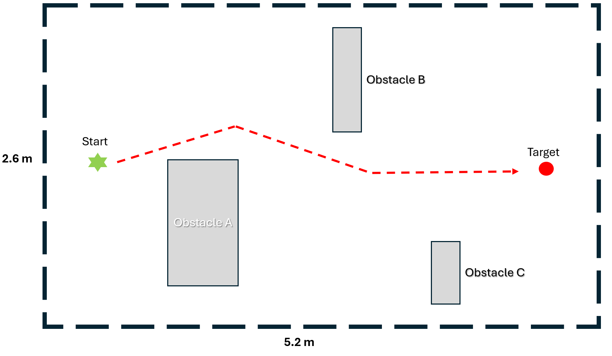
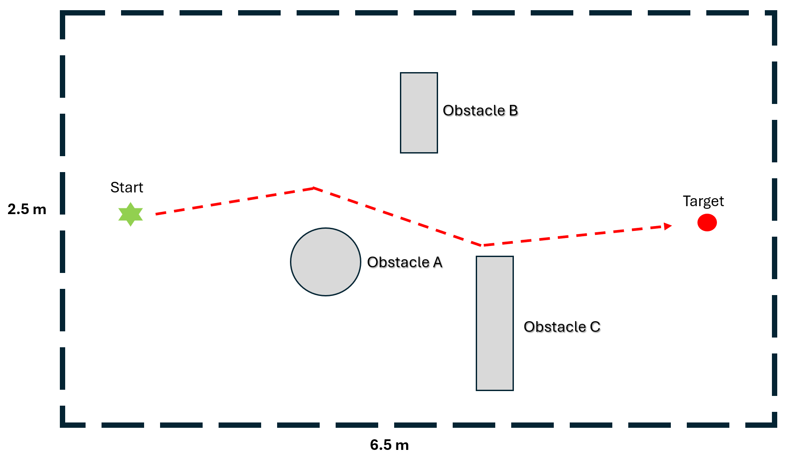

# Robot Control Evaluation

This directory contains supplementary materials for the robot control evaluation described in the paper.

## Overview

The robot-control evaluation investigates the feasibility of using a glasses-based wearable sensing platform as a hands-free control interface for robotic systems.

Two robotic platforms were used:

* TurtleBot3 Burger mobile robot
* DJI Tello drone

Participants were asked to navigate the robot or drone from a predefined starting location to a target location while avoiding obstacles placed in the environment.

A total of 14 participants completed the evaluation.

---

## Control Modalities

Three wearable interaction modalities were evaluated.

### IMU Control

Head movements captured by the onboard IMU were translated into robot navigation commands.

The IMU was sampled at 100 Hz and streamed to a host computer for real-time processing.

#### Calibration

Before each trial, participants performed a 3-second calibration procedure while maintaining a comfortable neutral head pose.

The average head orientation observed during this period was used as the participant-specific reference pose.

Subsequent movements were interpreted relative to this neutral pose.

#### Motion Detection

The controller continuously estimated head orientation and computed deviations from the calibrated reference pose.

Two rotational degrees of freedom were used:

* Pitch (head up/down motion)
* Roll (head left/right tilt)

A threshold-based motion detection strategy was adopted to suppress small involuntary movements and sensor noise.

For TurtleBot3 control, orientation deviations were converted into discrete navigation commands with multiple control levels. Larger head movements produced higher command magnitudes, enabling proportional control while maintaining simple interaction.

The mapping was:

| Head Motion      | Command    |
| ---------------- | ---------- |
| Head Down        | Forward    |
| Head Up          | Backward   |
| Head Left        | Turn Left  |
| Head Right       | Turn Right |
| Neutral Position | Stop       |

No user-specific training was required.

#### Drone IMU Control

For DJI Tello control, a more conservative discrete-action strategy was used to improve safety and command stability.

At each control step, the controller selected the dominant head-motion direction and generated a single movement command. Simultaneous commands were not allowed.

The mapping was:

| Head Motion      | Drone Action  |
| ---------------- | ------------- |
| Head Up          | Move Forward  |
| Head Down        | Move Backward |
| Head Left        | Move Left     |
| Head Right       | Move Right    |
| Neutral Position | No Action     |

A larger motion threshold was used for drone control than for mobile-robot control in order to reduce unintended commands during flight.

No user-specific model training was required beyond the initial neutral-pose calibration.

The IMU was sampled at 100 Hz.

Before each trial, participants performed a 3-second calibration procedure to estimate a neutral head pose.

Subsequent pitch and roll deviations were interpreted relative to this baseline using threshold-based motion detection.

No user-specific model training was required.

---

### Gesture Control

An outward-facing camera on the glasses was used for real-time hand-gesture recognition.

The gesture-recognition pipeline consisted of:

1. Hand localization using MediaPipe Hands.
2. Six-class gesture classification using a YOLO11n-based classifier.
3. Temporal voting to improve command stability.

Recognized gestures were mapped to robot-control commands.

Supported commands included:

* Forward
* Backward
* Left
* Right
* Stop
* Up / Down (drone only)

- Details: Each frame was first processed by MediaPipe Hands to detect a single hand; the resulting bounding box was padded and cropped into a hand-only ROI, which was then passed to a YOLO11n-based gesture classifier. The classifier was trained on six hand-present commands: stop_or_drone_down, left, right, up, backward, and forward. The original nothing class was instead handled by the detector: when no hand was detected, the system output no_hand. For fine-tuning, we collected one minute of real-time gesture images per class from three users wearing the glasses. The fine-tuned model generalized well to other users, that new users do not need to train personalized models.
Before fine-tuning, the classifier achieved 95.31% accuracy on the refreshed test set, with most errors occurring between up and forward. After five additional epochs from the previous best checkpoint, the ROI classifier reached 100.00% accuracy on a held-out ROI test set of 1,023 images, with no observed test-set errors. To reduce command flickering during real-time control, the demo used a lightweight debounce mechanism: a new gesture was accepted only if it appeared in two consecutive classified frames with confidence above 0.55; otherwise, the previous stable command was preserved.

---

### Multimodal Control

The multimodal condition combined speech and gesture input.

Voice commands were captured using the audio module on the glasses.

The audio pipeline consisted of:

1. Audio acquisition.
2. Speech transcription using a streaming ASR pipeline.
3. Intent matching against predefined command templates.
4. Command execution.

Natural-language expressions that conveyed equivalent intents were mapped to the same control action.

Examples:

| User Utterance | Intent    |
| -------------- | --------- |
| "forward"      | Forward   |
| "move forward" | Forward   |
| "go ahead"     | Forward   |
| "stop"         | Stop      |
| "turn left"    | Turn Left |

For drone-control experiments, environmental noise suppression was additionally applied to improve speech robustness.

Gesture input could be used together with voice input during operation.

- Details: The glasses streamed out 8 kHz audio to the pc, the audio was upsampled to 16 kHz and processed by a low-latency streaming ASR pipeline using Vosk small English with a constrained command grammar. To reduce latency, the system used partial ASR transcripts rather than waiting for final utterances. A rule-based parser first detected explicit commands such as stop, forward, backward, left, right, up, and down, which were emitted immediately.
For more natural phrases, the system used a lightweight semantic fallback with an INT8 ONNX version of paraphrase-MiniLM-L3-v2. The transcript embedding was compared with cached command-template embeddings, and an intent was emitted only when the top similarity score exceeded 0.70 and its margin over the second-best intent exceeded 0.12. Voice intents were mapped to the same runtime labels as the gesture system, such as mapping “go ahead” or “can you proceed” to forward, and “halt” or “remain still” to stop. In offline testing with recorded glasses audio, the system correctly mapped a fuzzy “proceed”-style command to forward. During real-time demos, the interface displayed both the live gesture output and the current voice transcript-to-command mapping.

---
## Experimental Environment

The figures below illustrate the representative layouts used during the robot and drone navigation evaluations.

Participants were instructed to navigate from the designated start location to the target location while avoiding obstacles. The illustrated trajectories are representative examples and do not indicate a required path.

### TurtleBot3 Navigation Task

For the mobile-robot evaluation, participants controlled a TurtleBot3 Burger robot through the selected interaction modality.

The navigation task required participants to:

1. Start from a predefined initial position.
2. Navigate around one or more obstacles.
3. Reach a designated target location.

The task was designed to require both forward motion and directional adjustments, allowing all navigation commands to be exercised during each trial.

### DJI Tello Navigation Task

For the drone evaluation, participants controlled a DJI Tello drone within the indoor environment.

The drone task followed a similar start-to-target navigation procedure while requiring participants to avoid obstacles and maintain stable flight.

The route required a combination of forward motion and lateral adjustments before reaching the target position.

For safety, all experiments were conducted under researcher supervision, and participants received a short practice session before beginning the evaluation.

---
## Experimental Procedure

Each participant completed navigation tasks using:

### TurtleBot3

1. Keyboard baseline
2. IMU control
3. Gesture control
4. Gesture + voice control

### DJI Tello

1. Joystick baseline
2. IMU control
3. Gesture control
4. Gesture + voice control

The order of conditions was balanced across participants when possible.

Before each trial, participants received a brief introduction and practice session for the corresponding control modality.

---

## Evaluation Metrics

### Objective Metrics

The following objective measures were recorded:

* Task success rate
* Task completion time

A trial was considered successful when the participant reached the target location without terminating the task prematurely.

### Subjective Metrics

After completing each condition, participants evaluated the interaction experience using a questionnaire.

The following dimensions were assessed:

* Naturalness
* Learnability
* Effortlessness
* Adaptability
* Directness

Scores were normalized relative to the corresponding conventional-controller baseline.

---

## Notes

The goal of this evaluation was not to optimize a particular interaction method, but rather to demonstrate that different sensing configurations supported by the platform can be rapidly deployed for robot-control applications using the same wearable hardware framework.

